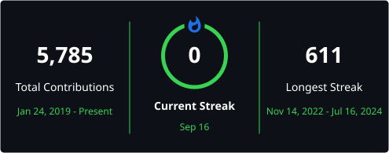

<h1 align="center">Hi, I'm Anton K.</h1>

  Backend developer · Node.js · TypeScript · microservices · databases

  
  
  
  

---

### About

I build backend systems and libraries in **Node.js / TypeScript**: database tooling, streaming utilities, microservices, and native addons when performance matters.

Currently interested in low-overhead observability, streaming I/O, and practical infrastructure around PostgreSQL, MySQL, Kafka, and Moleculer.

---

### Featured projects

| Project | Description |
| --- | --- |
| [**zip-password-stream**](https://github.com/JS-AK/zip-password-stream) | Streaming ZipCrypto unzip/zip for Node.js — one-pass parse, no buffering, zero deps |
| [**watchdog**](https://github.com/JS-AK/watchdog) | Native Node.js addon that detects event loop freezes with near-zero overhead |
| [**db-manager**](https://github.com/JS-AK/db-manager) | Database manager for Node.js applications |
| [**db-orm-benchmarks**](https://github.com/JS-AK/db-orm-benchmarks) | ORM benchmarking suite for Node.js |
| [**remote-objects**](https://github.com/JS-AK/remote-objects) | Actor-style remote objects on Node.js worker threads |
| [**kafkajs-mock**](https://github.com/JS-AK/kafkajs-mock) | Mock implementation of KafkaJS for tests |
| [**pg-migration-system**](https://github.com/JS-AK/pg-migration-system) · [**mysql-migration-system**](https://github.com/JS-AK/mysql-migration-system) | Migration systems for PostgreSQL and MySQL |
| [**excel-toolbox**](https://github.com/JS-AK/excel-toolbox) | Utilities for working with Excel files in Node.js |

---

### Stack

`TypeScript` · `JavaScript` · `Node.js` · `C++` · `PostgreSQL` · `MySQL` · `Kafka` · `Moleculer` · `Docker`

---

### GitHub stats

<!-- github-readme-stats.vercel.app is paused (503); use maintained mirrors instead -->

  
  

  

  

---

  Open to interesting backend and infrastructure work. Feel free to open an issue or reach out via GitHub.

